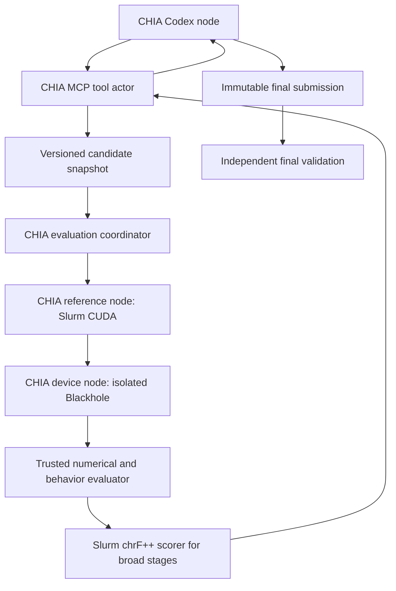

# PortForge autonomous CHIA campaign

This example runs a new Codex engineer that writes and optimizes a backend from
an empty source workspace. It is distinct from the earlier, manually developed
NLLB port. No earlier implementation, configurations or performance results are
copied into the agent's context. Only verified public model weights and FLORES
data are reused.

## Execute

Use the existing `chia_env` Python on the Mac, the existing Codex subscription
login, and the existing `tt_box` / `student_lab` SSH aliases. Do not copy auth.json
into this repository or to hardware workers. Codex itself uses its existing login;
the agent's tools cannot read credentials. No new dependencies are installed.

From this directory:

```bash
python prepare_data.py --archive runs/data/flores200_dataset.tar.gz \
  --download --output runs/data/corpus.json
python -m unittest discover -p 'test_*.py' -v
python run.py --corpus runs/data/corpus.json --preflight-only
python run.py --corpus runs/data/corpus.json --hours 6 --rounds 24
# Or keep running after this terminal session:
python run.py --corpus runs/data/corpus.json --hours 6 --rounds 24 --detach
```

An existing verified FLORES archive can be supplied without `--download`.
NumPy-specific evaluator tests are skipped on the minimal Mac environment and
must also run with the existing TT Python (`python -m unittest test_assess -v`).
Do not interpret the skips as completed tests. The launcher repeats the device
and Codex preflight before every fresh campaign, checks weight/repository pins,
and refuses to launch if those checks fail.

## Real CHIA graph and execution topology



`run.py` starts a native local Ray controller. `workflow.py` schedules real
`ChiaFunction.chia_remote` calls and exposes `ChiaTool` methods to Codex. The remote
adapters execute through SSH and Slurm. The remote hosts are **not** represented
as Ray/Docker workers. Consequently this deployment does not require a `chia up`
cluster.yaml; its effective resource mapping is explicit in `ray.init`:
one Codex slot, one Slurm submission slot, four TT slots and four coordinators.
CHIA's own profiler writes graph/timing events under each run's `chia-profile/`.
The lab has no usable Docker daemon for this account; no container provisioning
or permission changes are hidden in the launcher.

Four cards are available for concurrent independent experiments. A device worker
discovers the actual PCI-to-device-minor mapping and acquires the shared advisory
lock before opening that card. It mounts only that device into its process
namespace. Using four cards does not imply four-way model parallelism.

NVIDIA baseline generation always runs in a new `sbatch` compute allocation;
translation scoring also uses Slurm compute. Login nodes only submit, poll and
transfer files. A failure cancels only the job submitted by that node.

## Artifacts and restart

### Continue an interrupted campaign

After confirming the old controller and remote inference workers have stopped,
recover the existing workspace without changing its candidate or evaluation:

```bash
python resume.py --campaign runs/<timestamp> --corpus runs/data/corpus.json \
  --hours 3 --rounds 24 --detach
```

This is a continuation, not a new from-scratch trial. It verifies the corpus,
frozen evaluator and archived source hashes, preserves the old status and saves
the new controller source under `recoveries/`. Round numbering continues;
completed results are restored, and jobs without a durable result report
interrupted rather than pretending an old Ray reference is still live. Such
jobs need a new evaluation after remote-worker reconciliation. The original
manifest, candidate source, test gates and held-out IDs remain unchanged.

The resumed controller runs a real isolated-device preflight. Model-capacity
errors retry with 30/60/120/240/300-second backoff within the continuation budget;
other failures still stop after two unsuccessful rounds. Source and `STATE.md`
provide continuity across ephemeral Codex sessions. The resumed controller does
not automatically reset cards. Its budget is checked between agent rounds, so a
round or final evaluation may run past the nominal end time.

`resume-*.launch.json` records the new PID and log. `status.json` identifies its
recovery directory and current round or retry wait. Do not use the original
manifest's PID to stop a resumed controller. A submitted campaign cannot resume
candidate editing through this command.

Capacity detection also reads explicit terminal error blocks from the agent log,
because the CLI wrapper may truncate the exception message. `watch_resume.py`
can supervise an already-running older continuation within a fixed wall budget:
it restarts only a stopped controller whose last round has a verified capacity
error, and never interrupts active evaluations. This is optional; new `resume.py`
controllers handle capacity backoff directly.

- `runs/<timestamp>/manifest.json`: seeds, workspace path, weights, corpus and
  runtime/harness identities, hidden final-test selection.
- `harness/`: exact launcher/evaluator sources; the remote harness is stored in
  a content-addressed directory so another launch cannot replace its worker.
- `edits/`: content-addressed versions of every agent file write.
- `events.jsonl`: observed tool actions and trial identities.
- `trials/<id>/source.json`: immutable source for that experiment.
- `trials/<id>/result.json`: full evaluation or error evidence.
- `trials/<id>/comparison.json`: baseline/current case-by-case speedups and
  output equality, when a correct TT baseline exists.
- `references/<id>/`: fresh NVIDIA inputs, expected outputs, timings and Slurm ID.
- `baseline.json`: first passing development snapshot; never overwritten.
- `agent-logs/`, `rounds/`, `chia-profile/`: reasoning/tool summaries, usage and
  CHIA execution records. Provider log text can be truncated; source snapshots
  and evaluator artifacts are authoritative.
- `submission.json`, `trials/final/result.json`, `status.json`: final source and
  independent verdict. A budget stop or harness error is not a successful port.

The writable agent workspace is a fresh temporary directory outside the CHIA
checkout, identified in the manifest. It persists across rounds. STATE.md and
the tool's `status` method allow recovery without carrying all prior context.
Every new `run.py` invocation creates a fresh campaign. To test a harness repair without
contaminating the experiment, fix/retest the harness and launch again; do not
copy backend.py from the failed run. Old runs remain available for audit.
Detached launches write a sibling `.log` and `.launch.json` with the controller
PID. On macOS, caffeinate prevents idle sleep only for that process's lifetime.
The wall budget is checked between rounds; an active round/final validation may
run past it. Stop a campaign with SIGINT to its recorded controller PID and check
its recorded Slurm job IDs; do not cancel all jobs belonging to the user.

Replay a saved evaluation without asking the model to reproduce its code:

```bash
python replay.py --campaign runs/<timestamp> --trial <trial-id> \
  --corpus runs/data/corpus.json
```

Replay verifies the archived source digest and uses the campaign's frozen remote
worker and reference implementation. Keep the matching local harness version
when replaying after controller/suite changes; this first version does not migrate
old workload schemas automatically.

## Isolation and acceptance limits

Codex has no host shell, enabled apps, memory import or inherited project context.
It has public web research and scoped MCP tools. A named filesystem profile
denies this repository and credential/session directories to native file tools.
The MCP server binds to loopback on this local Ray deployment. Its per-run
approval configuration covers only these user-authorized tools.

Candidate commands run in a Bubblewrap namespace with no network and an isolated
process view. Public TT source/runtime and weights are read-only. Previous ports,
credentials, reference outputs and human translations are not mounted. The
candidate receives tokenized inputs, and produces outputs; comparison happens
outside its namespace. Generated TT directories are private to each sandbox.

The wrapper rejects common CPU learned-compute operations using TorchDispatchMode
and requires observed TT compute/trace calls for generation. These checks are
useful regression detectors, **not proof against hostile Python**. Candidate code
shares an interpreter with the measurement wrapper and can theoretically tamper
with it; final source review remains mandatory. Custom kernels may need a reviewed
instrumentation extension before acceptance. Never silently remove these gates.

No run is called production-certified. Current scope is greedy B1–4, source <=256,
generation <=64, five languages/eight directions. Full means all 1,012 FLORES
devtest rows in these directions, not every FLORES language. Final validation uses
new transformed inputs, because full-corpus rows cannot remain unseen afterward.
Serving concurrency, beam search, streaming, long contexts, soak tests and all
language pairs need separate contracts and evidence.

The suite is independently implemented using public FLORES data and translation
metamorphic properties. It does not claim to run CTranslate2's C++ test suite.
chrF++ uses the already-installed SacreBLEU 2.5.1 on the reference cluster. Compare
identical requests, timing boundaries and token counts; a shorter answer is not
automatically a kernel speedup. Memory snapshots are not peaks; five-repeat p95
is descriptive rather than an SLA. Bandwidth is unavailable unless the agent
produces actual profiler/counter evidence. NLLB's noncommercial model license
still applies independently of code licensing.

## Extending beyond NLLB

Keep `PortingTools`, source snapshots, hardware leases, isolation, Codex lifecycle
and CHIA graph. Supply a new model task, backend protocol, reference worker,
workload generator and independent acceptance policy. `suite.py`, the current
reference worker, weight mount and tensor/generation checks are deliberately
NLLB-specific in this first version. This is a reusable orchestration foundation,
not yet a plug-and-play port for every model or hardware stack.

Research starts with [the TT guide](agent/TT_PORTING_GUIDE.md), which links public
upstream documentation, model code, tests, issues and PRs. It is a retrieval map;
dumping the entire repository into context would make the agent less effective.
