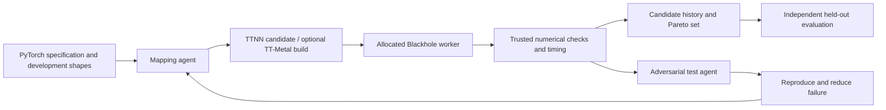

# PortForge-TT historical record

Reference only: do not load this file into every agent session. Start with
[PROJECT.md](PROJECT.md) and consult this archive for build provenance, earlier
decisions, or troubleshooting. The snapshots below describe the state before
hardware verification and the smoke-directory split on September 14, 2026.
Statements about pending card allocation are historical: the user subsequently
authorized all four cards, including parallel experiments. Current status lives
in PROJECT.md and ../portforge-tt-smoke/SMOKE.md.


---

## Project notebook before cleanup

# PortForge-TT: project notebook

Last updated: 2026-09-14. Phase: subscription-backed agent smoke loop; device allocation pending.

## Source of truth

- [Hackathon proposal](../../assets/proposal.tex): compact project commitment.
- [University proposal](../../assets/uni_proposal.tex): research questions,
  scope, evaluation, and deliverables.
- [Earlier discussion](../../assets/2026-08-20.pdf): background alternatives;
  the submitted proposals supersede its standalone Blacksmith-TT scope.
- [CHIA paper](../../assets/chia_paper.pdf): framework and case studies.
- [Saved hackathon brief](../../assets/hackathon.md).
- [Live hackathon requirements](https://agentic-arch.org/hackathon.html),
  checked September 14: final submission is **September 24, 2026 (AoE)**,
  consisting of a four-page paper and an open-source loop with results.
  The saved brief's September 20 deadline is outdated. Recheck final formatting
  instructions before submitting.
- [Setup and verification](SETUP.md).
- [Agent smoke loop](../portforge-tt-smoke/SMOKE.md): subscription authentication and executable repair demo.

## What we are building

An agentic CHIA loop that finds efficient TTNN/TT-Metal mappings for transformer
operators and small fused subgraphs on real Blackhole cards. A testing agent
challenges the mappings with adversarial inputs; minimized counterexamples
feed back into optimization. Correctness gates control admission to a
latency–accuracy Pareto set.

This combines PortForge's mapping search with Blacksmith's adversarial testing
and repair. The proposal does **not** require a general compiler, porting an
entire model, changing hardware, or finding previously unknown product bugs.
Controlled failures and negative optimization results are valid evidence.

Research questions from the university proposal:

1. Does measured agentic search improve latency/throughput over stock TTNN,
   recommended configurations, random search, and a single-pass agent?
2. Does adversarial feedback find failures missed by random inputs and improve
   correctness on held-out workloads?
3. Which mapping choices and feedback signals explain the improvements?

## CHIA concepts we will use

CHIA is orchestration infrastructure; it neither translates PyTorch into TTNN
nor supplies the numerical oracle automatically. The loop is ordinary Python.
`@ChiaFunction(resources=...)` wraps a node; `.chia_remote(...)` schedules it
through Ray and `get(...)` retrieves the result. A direct function call runs
locally. Resources describe available logical capabilities on workers.

`ChiaTool` exposes selected functions through MCP so an agent can request
evaluation. A tool server can dispatch a function to a different worker using
`fn.chia_remote_blocking`. Deterministic Python code should still own the final
accept/reject decision and budget limits.

Use CHIA profiling for orchestration time and lineage. Use synchronized device
measurements/TT profiling for kernel performance: CHIA node wall time includes
scheduling, Python, compilation, transfers, and other overhead.

Cache agent outputs and builds for replay using explicit per-candidate tags.
Do not treat cached hardware timings as fresh reruns. A cache identity must
include candidate content, workload, evaluator version, and software/hardware
configuration; CHIA's call tags do not establish these scientific guarantees.

Useful local references:

- [Basics](../../docs/getting-started/chia-basics.rst) and
  [architecture](../../docs/concepts/overview.rst).
- [Functions](../../docs/user_guides/chia_function.rst),
  [tools](../../docs/user_guides/chia_tool.rst),
  [clusters](../../docs/user_guides/cluster_config_reference.rst),
  [containers](../../docs/user_guides/docker_images.rst), and
  [cache/bypass](../../docs/user_guides/caching_and_bypass.rst).
- [CIRCT solver](../circt_issue_solver/README.md): reproduce/repair followed by
  independent deterministic verification.
- [memcpy](../memcpy/README.md): generated code, build/run nodes, and feedback.
- [timing optimization](../timing_opt/README.md): measured optimization loop.
- [OpenCode example](../opencode-nvidia/README.md): agent/MCP wiring; its model
  provider is an example, not this project's chosen provider.

The paper's gem5 example illustrates overfitting to visible benchmarks. Its
RISC-V and CIRCT examples motivate keeping verification independent of the
implementation agent. Preserve that separation here.

## Initial architecture



Initial smoke deployment: the CHIA driver and Codex CLI run on macOS using the
existing ChatGPT login. A local Ray worker dispatches the trusted evaluator over
SSH to Ubuntu. This keeps model authentication on the Mac. Linux runs the CPU
reference and, once a card is allocated, Blackhole execution. A Linux-resident
driver remains an option when provider authentication is available there.
Add separate logical/container workers after the basic path works.
Containerization of generated code and separation of the trusted
evaluator are prerequisites to unrestricted autonomous candidate execution.

The Blackhole is the target under optimization. The coding model can be a
hosted Gemini/Vertex model; it does not need to run on Blackhole. The proposal
requests $900 ($650 model calls, $150 GCP, $100 contingency); this is a request,
not confirmation of available credits or authorization to spend it all.

## Workload decision

Final workload selection remains open, as promised in the proposal. First
validate an elementary TTNN operation, then profile **residual addition +
RMSNorm** as the leading small-subgraph candidate. This comes from the earlier
discussion, not a measured finding. Consider gated projection only after the
first family is working. Avoid committing to many models during bring-up.

Choose a family only if it has a defensible reference, representative model
shapes, measurable mapping choices, and enough performance headroom. TTNN
first: layout, sharding, memory placement, supported precision/math fidelity,
and fusion controls. Prepare the source build for profiling now; implement
lower-level kernels if the TTNN controls are insufficient. TT-Forge, vLLM,
model weights, CUDA, and Chipyard are not
required for the initial operator loop.

## Experimental contract to freeze before search

- Specify operator semantics, supported shape/dtype/layout domains, epsilon,
  and input quantization before comparing implementations.
- Compute a CPU PyTorch reference. Define per-workload absolute/relative error
  and any task-specific similarity thresholds. PCC alone is insufficient:
  constant vectors, scaling errors, and non-finite values need explicit checks.
- Distinguish unsupported inputs, compile errors, timeout/crash, numerical
  failure, and performance regression. A timeout is not proof of a silicon bug.
- Keep development challenges separate from a final held-out shape/seed split
  hidden from **both** agents. Do not iterate on final hold-out results.
- Separate compilation, warm-up, host/device transfers, and steady-state
  execution. Synchronize before reading timing. State whether each reported
  metric includes transfers, and rerun finalists with the same protocol.
- Compare candidates and baselines using the same native build and profiling
  settings. Do not attribute a wheel-versus-source build difference, or Tracy
  overhead, to an algorithmic speedup.
- Give random search and agent baselines comparable evaluation budgets. Report
  model/API cost separately, and include the no-adversarial-feedback ablation.
- Save source hashes, parent candidate, full configuration, software versions,
  device/grid/firmware, seeds, errors, raw timing samples, failures, and logs.
- Preserve minimized failures as regressions. Label injected defects clearly;
  report mutation kills/repair claims only when that experiment was performed.
- Report per-workload results and failures, not just the best speedup. The
  proposal's success criterion is a repeatable improvement on at least one
  non-trivial fused subgraph while preserving held-out numerical acceptance.

## TODOs and completion criteria

### Bring-up

- [x] Read both proposals, discussion slides, paper sections, and CHIA docs.
- [x] Inspect macOS and SSH to the Blackhole host.
- [x] Identify four p150b devices, driver, firmware, hugepages, and containers.
- [x] Verify existing local CHIA imports/CLI and eight local-call unit tests.
- [x] Install isolated CHIA 1.0.1 + TTNN 0.72.0 + Torch 2.14.0 CPU.
- [x] Pass dependency check, TTNN tensor conversion, CHIA CPU worker call,
      and 15 existing CHIA local/remote tests on the host.
- [x] Build pinned TT-Metal with CHIA and profiling in a separate uv environment;
      verify native imports/library resolution and 15 CHIA tests. Hardware and
      tensor execution remain separate pending checks below.
- [x] Verify GPT-6 Astra through CHIA's CodexLLM using the existing ChatGPT
      subscription login, without an API key.
- [x] Run a bounded injected-defect repair loop: CHIA/Ray -> SSH CPU evaluator
      -> Codex correction -> independent verification; all five cases pass.
- [ ] Confirm a card allocation and record logical ID to PCI mapping.
- [ ] Run one TTNN operation and compare its output with PyTorch.
- [ ] Execute the same evaluation through a resource-gated CHIA node.
- [ ] Record synchronized warm timings; confirm repeatability on one workload.

### Complete the loop

- [x] Add an elementary addition smoke harness with a constrained JSON candidate,
      fixed numerical oracle, one model-call budget, and saved run artifacts.
      This is bring-up scaffolding, not an optimization or adversarial-search result.
- [ ] Freeze the initial workload family and development/held-out split.
- [ ] Build a trusted evaluator with timeouts, exclusive device access,
      numerical gates, regression replay, and structured result records.
- [ ] Add candidate/build/evaluation nodes and persistent experiment history.
- [ ] Configure the funded LLM provider and explicit per-run cost limits.
- [ ] Add the mapping agent, then adversarial generation and failure reduction.
- [ ] Add all proposed baselines and equal-budget comparisons.
- [ ] Add bounded search, resumable runs, lineage, and Pareto selection.
- [ ] Package the worker reproducibly; if adding a Dockerfile under
      `dockerfiles/`, add its corresponding GitHub Actions workflow.

### Evaluation and submission

- [ ] Freeze software, evaluator, prompts, budgets, and experiment configs.
- [ ] Run baselines/ablations, rerun finalists, then unlock final hold-out.
- [ ] Collect plots, raw records, failures, costs, and limitations.
- [ ] Prepare the four-page report and reproducible open artifact by Sep 24 AoE.
- [ ] Human-review contributions and disclose AI assistance before submission.

## Decisions and open items

- 2026-09-14: Follow the submitted PortForge-TT proposal; keep workload selection
  contingent on profiling. Keep this notebook separate from agent instructions.
- 2026-09-14: Prefer the existing host driver/firmware and an isolated userspace
  environment. Current TTNN installation guidance requires newer firmware;
  evaluate a pinned older release before considering shared firmware changes.
- 2026-09-14: TTNN 0.72.0 imports/converts tensors with Torch 2.14.0 CPU.
  Its initialization opened all four cards through UMD even without an explicit
  `open_device` call; require verified visibility isolation before claiming a
  worker accesses only its allocated card. No compute kernel has been tested.
- 2026-09-14: Reviewed the colleague's source-build guide. Prepare an editable
  TT-Metal development environment now for native changes and detailed
  profiling. uv is the package manager; the native build adds the capability.
- 2026-09-14: Source build completed at `~/portforge-tt/tt-metal` (v0.72.0).
  Use its `python_env` for development and the original `.venv` for wheel
  comparison. Source TTNN import, library resolution, profiler CLI, dependency
  checks, and CHIA tests pass. Empty `TT_VISIBLE_DEVICES` hides all cards;
  `from_torch` then fails because even host tensors need a Metal device context.
  Resume tensor/kernel testing only with the allocated card visible.
- Pending: Which card is allocated, and are Blackhole CPU/Linux experiments
  active on any card? Empty host process lists do not answer this fully.
- Pending: LLM provider/project, usable credit amount, and per-run spending cap.
- Pending: TTNN version accepted by actual device execution, not just import.

---

## Setup and build history

# PortForge-TT setup log

Observed September 14, 2026. This is a machine bring-up record, not a claim that
the complete proposed agentic loop is implemented.

## Roles and prerequisites

| Machine | Required now | Later / optional |
|---|---|---|
| macOS ARM64 | Git, SSH, Python 3.10.19, editable CHIA and its pinned Ray | CPU PyTorch for local analysis, Graphviz `dot` for rendered graphs |
| Blackhole Ubuntu host | Matching CHIA/Python/Ray, CPU PyTorch oracle, TTNN wheel, working TT-KMD/firmware/hugepages, allocated card | Pinned TT-Metal checkout/compiler for custom kernels; device profiler; isolated agent/evaluator containers |
| LLM provider | Configured model endpoint and budget before agent calls | GCP workers/storage if funded and useful |

macOS does not need a Tenstorrent driver or TTNN device runtime. The initial
subscription-backed smoke driver runs on the Mac and dispatches the trusted
evaluator over SSH; see [SMOKE.md](../portforge-tt-smoke/SMOKE.md). Docker
Desktop on macOS does not provide access to remote PCIe cards.

## Existing environment inventory

Local:

- macOS 26.6.2, ARM64. Git, SSH, uv, Homebrew, and `pdftotext` already available.
- Existing conda environment: `~/miniconda3/envs/chia_env`.
- Python 3.10.19, Ray 2.54.0, editable CHIA pointing at this repository.
- Working tree revision: `16c35e92aaaf9511c6453bf94cd5cf589698f4e3`.
- Codex CLI 0.153.4 at `/opt/homebrew/bin/codex`; `codex login status` reports
  ChatGPT authentication. A live CHIA CodexLLM call requesting `gpt-6-astra`
  succeeded without an API key. No credentials were inspected or copied.
- Refreshed the editable installation and stale generated `chialoops.egg-info`;
  installed CHIA metadata now correctly reports 1.0.1. Dependencies unchanged.
- `pip check` passed. CLI help worked. Eight `TestChiaFunctionLocal` tests
  passed with a temporary Ray instance. The first sandboxed run failed because
  macOS denied Ray's process inspection; the unsandboxed rerun passed.

Remote (SSH alias `tt_box`; connection details stay in personal SSH config):

- Ubuntu 22.04.5 LTS, x86_64, kernel 6.8.0-138-generic.
- Approximately 503 GiB RAM and 3.3 TiB free filesystem space at inspection.
- Four Tenstorrent p150b cards; `/dev/tenstorrent/0` through `3`.
- PCI addresses `0000:01:00.0`, `0000:41:00.0`, `0000:42:00.0`,
  `0000:c1:00.0`. Do not infer TTNN logical device ordering from this list.
- TT-KMD 2.10.0, firmware bundle 19.4.2.0 reported on all four cards.
- 16 one-GiB hugepages, with `/dev/hugepages-1G` mounted. `/proc/meminfo` reports
  zero **2 MiB** hugepages; this does not mean hugepages are missing.
- `docker` is Podman's compatibility command, version 3.4.4. Rootless Podman
  listing works; CHIA's complete Docker lifecycle is not yet validated here.
- Existing `~/chia` checkout is revision
  `325c160e6526433cb57c56b6ce4ff430c5ff70de`, distinct from the Mac checkout.
  Existing `~/miniconda3/envs/chia_env` has Python 3.10.19/Ray 2.54.0, but no
  TTNN or Torch. Its dependency check passed.
- `/opt/tt-bh-linux` contains a pre-existing Blackhole CPU/Linux setup. Do not
  assume its cards are available just because no host Python process is seen.

## Working monitoring command

The user's `~/.local/bin/tt-smi` fails with missing `pydantic`. The shared
`tt-smi` launcher points at a different user's Python interpreter. Invoking it
with the Python installed beside it works without modifying shared files:

```bash
ssh -o ClearAllForwardings=yes tt_box \
  '/opt/tenstorrent/.tenstorrent-venv/bin/python /opt/tenstorrent/.tenstorrent-venv/bin/tt-smi -s'
```

This reports tt-smi 4.0.0, UMD 0.9.1, firmware, and telemetry. Device enumeration
and telemetry are verified; compute execution is a separate check.

`ClearAllForwardings=yes` avoids an unrelated configured port-8888 forward
colliding with a local listener. Normal SSH host verification remains enabled.
No private key material needs to be copied to the remote machine.

## Version selection

The current [TT-Metal installation guide](https://github.com/tenstorrent/tt-metal/blob/main/INSTALLING.md)
and v0.78.0's guide specify Blackhole firmware 19.8.1 and tt-smi >=5.0.0.
Installing the latest runtime against this host's 19.4.2 firmware is therefore
not the initial plan.

The [v0.72.0 guide](https://github.com/tenstorrent/tt-metal/blob/v0.72.0/INSTALLING.md)
still lists firmware 19.2.0, KMD >=2.5.0, and tt-smi >=3.0.38. v0.73.1 and later
guides checked in this session list 19.8.1. Thus **TTNN 0.72.0 is the initial
compatibility candidate**, not a hardware-validated conclusion. Actual runtime
compatibility must be checked before workload measurements.

Use a CPU-only PyTorch wheel: the accelerator computation is performed by
TTNN, while PyTorch supplies the independent CPU reference. The selected
release's [development requirements](https://github.com/tenstorrent/tt-metal/blob/v0.72.0/tt_metal/python_env/requirements-dev.txt)
use Torch 2.11.0, but PyPI's vulnerability metadata flags that version with
[GHSA-rrmf-rvhw-rf47](https://osv.dev/vulnerability/GHSA-rrmf-rvhw-rf47), fixed in
2.13.0. We selected **Torch 2.14.0 CPU** instead; validate interoperability with
the older TTNN release. Do not install that entire requirements file: it contains many
unneeded model/formatting dependencies and a Pydantic pin conflicting with
CHIA's requirements.

Dependency review: TTNN's PyPI metadata points to the official Tenstorrent
repository, declares Apache-2.0, and reported no published vulnerabilities for
0.72.0 on this date. Torch 2.14.0 and pytest 9.0.3 also reported no published
vulnerabilities in that metadata. Pytest declares MIT; Torch's metadata lists
BSD/MIT/Apache-family and BSL-1.0 licenses including LLVM-exception components.
These are environment-only additions; redistribution must retain applicable
notices. This metadata check is not a complete security audit.
No core CHIA dependencies are being changed for PortForge.

## Isolated remote project

Target location: `~/portforge-tt/`, with `.venv` and `chia/` beneath it. The new
CHIA directory is a tracked-source snapshot of the Mac revision above, copied
using `git archive`; it does not contain `.git`, user assets, or credentials.
The existing `~/chia` and its conda environment remain separate.

Installed and checked:

| Component | Version |
|---|---|
| Python | 3.10.19 |
| CHIA / chialoops | 1.0.1, source snapshot identified above |
| Ray | 2.54.0 |
| TTNN | 0.72.0 |
| PyTorch | 2.14.0+cpu |
| pytest | 9.0.3 |

Commands used after copying the CHIA source into the new directory:

```bash
# On tt_box. These commands were run in a newly created project directory.
~/miniconda3/envs/chia_env/bin/python -m venv ~/portforge-tt/.venv
source ~/portforge-tt/.venv/bin/activate
python -m pip install -e ~/portforge-tt/chia
python -m pip install --only-binary=:all: torch==2.14.0 \
  --index-url https://download.pytorch.org/whl/cpu
python -m pip install --only-binary=:all: ttnn==0.72.0 pytest==9.0.3
python -m pip check
```

To use the original wheel environment (source development is described below):

```bash
# On macOS:
conda activate chia_env
chia --help
ssh -o ClearAllForwardings=yes tt_box

# In that remote SSH shell:
source ~/portforge-tt/.venv/bin/activate
cd ~/portforge-tt/chia
```

Verification completed:

- `pip check`: no broken requirements, both local and new remote environments.
- TTNN import and host tensor conversion: BF16 zeros, shape `(2, 4)`, round trip
  to/from Torch with exact equality. This does not prove Blackhole arithmetic.
- **Observed side effect:** despite no explicit `ttnn.open_device` call, the
  TTNN path initialized UMD, discovered and opened all four cards, then closed
  them on process exit. The test's printed phrase "no device opened" was
  inaccurate; logs show device-driver initialization. No compute operation was
  requested. Future monitoring/import checks must account for this behavior.
- `@ChiaFunction(resources={"portforge_cpu": 1})` dispatched a CPU Torch sum
  through Ray; returned `6.0` from a different worker PID.
- Fifteen existing `TestChiaFunctionLocal` and `TestChiaFunctionRemote` unit
  tests passed on the new remote environment. Eight local-call tests passed on
  macOS. A full hardware/tool-dependent CHIA test suite was not run.
- Temporary Ray instances were shut down after verification.

Remote reproducibility records:

- `~/portforge-tt/CHIA_REVISION`: source commit used for the snapshot.
- `~/portforge-tt/requirements-resolved.txt`: installed package freeze. Its
  editable CHIA entry is machine-specific; use `CHIA_REVISION` to reconstruct.
- `~/portforge-tt/setup-verification.json`: CPU worker result and test count.

To rerun the existing CHIA checks without opening TT devices:

```bash
cd ~/portforge-tt/chia
~/portforge-tt/.venv/bin/python - <<'PY'
import ray
import unittest

ray.init(address="local", include_dashboard=False, num_cpus=2,
         object_store_memory=100 * 1024 * 1024,
         _node_ip_address="127.0.0.1")
try:
    suite = unittest.defaultTestLoader.loadTestsFromNames([
        "chia.base.test.ChiaFunction_tb.TestChiaFunctionLocal",
        "chia.base.test.ChiaFunction_tb.TestChiaFunctionRemote",
    ])
    result = unittest.TextTestRunner().run(suite)
finally:
    ray.shutdown()
raise SystemExit(not result.wasSuccessful())
PY
```

This starts its own temporary Ray instance; it does not use the example
cluster YAML's global `ray stop` commands. `chia up` / `chia job submit`, a
containerized Blackhole worker, actual device arithmetic, and synchronized
performance profiling remain unverified.

## Before any hardware run

1. Establish which card is allocated and whether other experiments use it.
2. Record the selected release's mapping between logical IDs and physical PCI
   devices. Do not assume a generic CUDA visibility variable controls TTNN.
3. Use one evaluation at a time on that card. Ray custom resources alone do
   not prevent non-Ray processes or other users from opening it.
4. Run an elementary operation with an explicit numerical assertion and timeout.
5. Only after that passes, test a `ChiaFunction` wrapping the same evaluation.

Firmware flashing, driver replacement, card resets, and host service/access
changes are not part of this userspace install. If the runtime proves
incompatible, document the exact requirement and coordinate the shared-machine
change with the lab rather than attempting automatic recovery.

## Source development setup: pip, uv, and the colleague's guide

Reviewed the [lab setup gist](https://gist.github.com/dongning-ma/5e34c8a478840da15c109e848b40be97)
and upstream [create_venv.sh](https://github.com/tenstorrent/tt-metal/blob/main/create_venv.sh)
on September 14. The gist's sequence is clone with submodules, native build,
create a Python environment, then activate it. It does not require TTNN in
system Python, conda base, or every named environment.

There are two separate decisions:

| Decision | What changes |
|---|---|
| pip vs uv | Package resolution/installation, environment management, and caching. Either can install the same TTNN wheel. uv can manage an existing venv. |
| Wheel vs source build | A wheel supplies prebuilt native libraries. A source build makes native changes rebuildable and adds the source-supported profiling/development workflow. |

The [uv environment documentation](https://docs.astral.sh/uv/pip/environments/)
recommends isolated environments and supports targeting an existing Python
environment. Our original `python -m venv` environment is a valid environment;
it does not become more capable merely by recreating it with uv.

For PortForge, the source build is worth preparing: native kernel edits and
detailed profiling are part of the intended research. Tenstorrent documents
that its [Tracy tools](https://docs.tenstorrent.com/tt-metal/latest/tt-metalium/tools/tracy_profiler.html)
are fully supported on source builds. The wheel environment remains available
as the initial baseline while the source path is verified.

The full `create_venv.sh` installs TT-Metal's broad development/model/triage
dependencies and an editable TTNN package. It also installs hooks and may
download Python. Running it against our existing environment would replace
that environment. Its development requirements include pins conflicting with
CHIA and the newer Torch selected above. Instead, prepare a focused environment
with Python 3.10.19, CHIA's required pins, the tested CPU Torch version, an
editable TTNN build, and dependencies needed by our selected tests/profiler.

Source setup completed; hardware execution remains pending:

- Cloned `~/portforge-tt/tt-metal` at tag `v0.72.0`, commit
  `ba9340e3a45ac5ba51c752a49341f2def28d0514`, including pinned submodules.
- Installed uv 0.12.13 inside `~/portforge-tt/.venv`. Official PyPI metadata
  declares MIT OR Apache-2.0 and reported no published vulnerabilities.
  Upstream's installer pins uv 0.9.26; our explicit newer pin is intentional.
- Created `~/portforge-tt/tt-metal/python_env` with uv using the existing
  Python 3.10.19 interpreter. This environment is separate from the wheel venv.
- Host already provides Clang 20, CMake 4.4.2, Ninja 1.10.1, NUMA/hwloc headers,
  and other native dependencies. No host package changes have been made.
- Configuration succeeded, including the existing ULFM MPI installation at
  `/opt/openmpi-v5.0.7-ulfm`. SFPI 7.52.0 was downloaded into the project by
  upstream CMake. The shared `/opt/tenstorrent/sfpi` was not changed.
- Native Release libraries, Python bindings, Tracy, and programming examples
  built and installed successfully (1,302 Ninja steps) with eight CPU cores.
  Installation prefix is the checkout's `build_Release/`, not a system directory.
- The source Python environment contains CHIA, the tested Torch/core package
  pins, uv 0.12.13, and tt-smi 5.2.0 (the release's development requirement).
  `uv pip check` passes, and `tt-smi --help` works. No monitoring resets ran.
- Fifteen CHIA local/remote tests passed in this environment; results are in
  `~/portforge-tt/source-chia-verification.json`. `python -m tracy --help` works.
  Tracy's compiled capture and CSV export binaries load and print usage.
- TTNN imports from `tt-metal/ttnn/ttnn/__init__.py`; its native extension loads
  from `tt-metal/ttnn/ttnn/_ttnn.so`. The extension's shared libraries resolve.
  These checks ran with `TT_VISIBLE_DEVICES` empty.
- A host-tensor round-trip probe stopped with **No chips detected in the
  cluster** at `ttnn.from_torch`. In this release, even a host tensor initializes
  the Metal context and requires a visible device. The source tensor round trip
  therefore remains unverified until a card is allocated; it was not counted
  as a passing test. CPU Torch and CHIA tests work without TT device access.
- The upstream source checkout remains clean. No firmware flashes, card resets,
  shared environment changes, or system package installations were performed.

Saved in `~/portforge-tt/`:

- `TT_METAL_REVISION` and `TT_METAL_SUBMODULES`: native source identity.
- `source-base-requirements.txt`: package constraints reused from bring-up.
- `source-requirements-resolved.txt`: final source environment package freeze.
- `source-configure.log` and `source-build.log`: native configure/build logs.
- `source-chia-verification.json` and `source-runtime-verification.json`:
  passed checks and the explicit unverified hardware/tensor status.

Use these commands to select the development environment explicitly:

```bash
ssh -o ClearAllForwardings=yes tt_box
source ~/portforge-tt/tt-metal/python_env/bin/activate
export TT_METAL_HOME="$HOME/portforge-tt/tt-metal"
cd "$TT_METAL_HOME"
python -c 'import sys; print(sys.executable)'
uv pip check --python "$VIRTUAL_ENV/bin/python"
tt-smi --version
```

The printed interpreter should end in `tt-metal/python_env/bin/python`. CHIA
and TTNN are editable installations in this environment. In contrast,
`source ~/portforge-tt/.venv/bin/activate` selects the original wheel environment.
Neither choice requires activating conda first.

Build commands (from the source environment and checkout):

```bash
# Incremental native rebuild; the initial run was additionally CPU-affinity
# limited so nested profiler builds also respected the eight-core limit.
CMAKE_BUILD_PARALLEL_LEVEL=8 ./build_metal.sh --build-programming-examples

# Refresh editable package registration when packaging changes:
uv pip install --python "$VIRTUAL_ENV/bin/python" -e .
uv pip install --python "$VIRTUAL_ENV/bin/python" -e ../chia
uv pip check --python "$VIRTUAL_ENV/bin/python"
```

The full development requirements file was deliberately not installed. Add
model-specific packages only when a selected workload needs them. This is a
focused source-development environment, not a promise that every upstream
model demo or test suite has all its optional dependencies.

The pinned UMD source documents an important distinction:

- **Unset** `TT_VISIBLE_DEVICES`: discover all devices.
- **Empty** `TT_VISIBLE_DEVICES`: enumerate no devices. The wheel environment
  and source environment both imported TTNN using this setting, without
  discovery logs. Tensor construction still requires a visible device.
- A full PCI BDF, e.g. `0000:01:00.0`: filter to that physical card. Use the
  allocated card's actual address; the example is not an allocation.

This behavior is implemented in
`tt_metal/third_party/umd/device/pcie/pci_device.cpp`. It is separate from
`TT_METAL_VISIBLE_DEVICES`. Use the UMD-level filter **before Python starts**
for later device tests. A visibility setting is not a reservation against other
users and is not a security boundary for arbitrary agent code.

---

## Original CPU smoke record

# Subscription-backed agent smoke loop

## Authentication decision

Use the existing Mac Codex CLI login for the local prototype. OpenAI documents
[ChatGPT subscription authentication](https://learn.chatgpt.com/docs/auth) and
[`codex exec` reusing saved CLI authentication](https://learn.chatgpt.com/docs/non-interactive-mode).
CHIA already provides `chia.models.codex.CodexLLM`, which wraps that command.
No new model SDK, API key, remote Codex installation, or credential copying is
needed. A live call requesting `gpt-6-astra` succeeded on September 14, 2026.
The CLI reports ChatGPT login; we did not inspect account credentials or verify
which workspace/tier is active. Subscription limits and workspace model
permissions still apply; successful calls do not establish an unlimited quota.

Direct OpenAI API usage has separate authentication/billing. This example is a
local, user-initiated CLI workflow. Public CI and an unattended shared service
need a separately designed authentication setup; do not publish cached login
files or mount them into candidate execution environments.

Gemini remains the intended hackathon provider. The candidate JSON and evaluator
are provider independent, but this smoke driver's model call currently uses
CodexLLM only. Switching `--model` to a Gemini name does not switch providers.
Add a Gemini backend after credentials and the hackathon model are selected;
retain the same cases, oracle, and budgets for comparisons. This smoke test does
not compare model quality.

## What the task proves

Target: BF16 tensor addition, `y = x + residual`.

1. CHIA dispatches a resource-gated Ray node on the Mac. That node invokes a
   trusted evaluator on the Linux host over SSH.
2. The evaluator runs the deliberately wrong `subtract` mapping and returns
   numerical failures. This is an injected defect, not a discovered TTNN bug.
3. Codex receives the contract and feedback, and returns a constrained JSON
   mapping. The agent cannot change the oracle or submit executable Python.
4. The evaluator tests the proposed mapping against the fixed reference.
5. A local ignored `runs/<UTC timestamp>/result.json` records the prompt,
   response, token usage, evaluator hash, cases, and outcomes.

There are five public development cases: random BF16 tensors at 32x64, 64x128,
and 17x33, all-zero inputs, and exact cancellation. The oracle sums quantized
inputs in float32 and rounds to BF16. Acceptance requires the same shape,
finite output, and `atol=0.001, rtol=0.01`. No private held-out set exists yet.

The budget is two evaluations and one model call, with no model retries.
Codex runs read-only with approval bypass explicitly disabled, in a temporary
working directory. The wrapper's default bypass setting is **not** used.
Personal `config.toml` is excluded to keep unrelated MCP servers out of the run;
the CLI's existing authentication and managed requirements still apply.

This validates plumbing and a numerical rejection/repair, not kernel-code
generation, optimization, adversarial search, or the full proposed research loop.
Residual-add + RMSNorm is the next subgraph after device bring-up passes.

## Run

From the Mac repository, with the existing `chia_env` activated and `codex` on
PATH:

```bash
python examples/portforge-tt/smoke_loop.py --backend cpu
```

CPU mode uses PyTorch on the remote host; it neither imports TTNN nor opens a
card. The remote location is the isolated `~/portforge-tt/tt-metal/python_env`
environment created in [SETUP.md](SETUP.md). The trusted evaluator is sent over
SSH stdin each time, so the Mac file is the evaluator source of truth.

Once a specific card has been allocated, use its full PCI address:

```bash
python examples/portforge-tt/smoke_loop.py --backend blackhole --pci ALLOCATED_PCI_BDF
```

`ALLOCATED_PCI_BDF` must be replaced with a real allocated address. Consult
SETUP.md for the observed `/dev/tenstorrent` to BDF mapping; do not infer it from
the logical TTNN index. `--host` can select another existing SSH alias with the
same project layout, and `--model` can select another accessible Codex model.

The Blackhole path filters `TT_VISIBLE_DEVICES` before Python starts, requires
exactly one enumerated card, checks its architecture, and opens logical device
0 within that filtered set. A per-user, per-BDF advisory lock prevents concurrent
runs of this evaluator by the same user. It is **not** a lab-wide reservation
or isolation from arbitrary processes. Ray resource labels only limit this
local driver's dispatches. Explicit lab allocation remains necessary.

Remote execution is bounded by GNU `timeout` (180 seconds plus a 10-second kill
grace), and the SSH subprocess has a 210-second timeout. A timeout/crash is an
infrastructure failure, not a numerical failure; the harness does not reset a
card. A forced kill cannot guarantee a healthy device afterward.

The device path collects 10 warm samples after 3 warm-up dispatches for each
case. They include host dispatch, output allocation, and device synchronization;
input/output transfers and initial compilation are excluded. These are
bring-up measurements, not isolated kernel timings or speedup evidence.

## Verification record

September 14, 2026:

- Live `CodexLLM(model="gpt-6-astra")` authentication probe passed.
- Connected CHIA/Ray -> SSH -> remote CPU -> Codex -> remote CPU loop passed.
  Subtraction failed four cases (zero + zero cannot distinguish subtraction),
  and Codex's `{"op":"add"}` passed all five with zero maximum absolute error.
- Nine offline example tests passed: numerical mutation rejection, non-finite
  and shape rejection, candidate validation, explicit device filtering, and
  transport record/timeout handling.
- The existing CHIA Codex backend suite passed: 31 tests passed, four opt-in
  live/remote tests skipped. The live subscription path was tested separately
  by the probe and repair loop above.
- Device API symbols were checked against the pinned TTNN 0.72.0 source with
  every card hidden. No hardware operation was run for this smoke task because
  card allocation is still pending. Hardware correctness and timings remain
  unverified.

Run offline tests on the Linux source environment:

```bash
cd ~/portforge-tt/chia
TT_VISIBLE_DEVICES='' ../tt-metal/python_env/bin/python -m unittest discover \
  -s examples/portforge-tt/tests -v
```

The test dependencies are already installed on the host. The Mac can run
`test_smoke_transport.py` without installing PyTorch. No core CHIA source or
dependency requirements were changed.


---

## Directory split and hardware verification — September 14, 2026

The user authorized any of the four cards and parallel experiments. Moved
smoke_loop.py, evaluate_add.py, tests/, SMOKE.md, and all earlier ignored runs/
from examples/portforge-tt/ to examples/portforge-tt-smoke/. Active project
instructions now load only the short PROJECT.md by default. SETUP.md is the
working command reference; this history is for targeted lookup. Mirrored the
layout in the isolated remote checkout without changing installed environments.

The complete CHIA/Ray -> SSH TTNN -> Codex -> SSH TTNN loop passed twice on
0000:01:00.0. Its first hardware record is
../portforge-tt-smoke/runs/20260914T154508.588753Z/result.json.
After adding explicit device-storage and physical-card assertions, it passed
again at ../portforge-tt-smoke/runs/20260914T154717.632281Z/result.json.
The strengthened evaluator verifies exactly one visible device, reads only
Tenstorrent device-node targets from its own /proc/self/fd, maps those nodes
through sysfs to the requested PCI BDF, checks Blackhole architecture, and
requires TTNN device storage for both inputs and the output before host copy.

The other three cards ran fixed subtraction/addition replays concurrently.
Records and native stdout/stderr are under
../portforge-tt-smoke/runs/replay-20260914T154746Z/.
These replays do not make model calls. All four cards rejected subtraction on
four of five cases (all-zero inputs also pass subtraction) and accepted addition
on five of five cases. Every strengthened record matched the current evaluator
SHA-256 and contained 10 positive warm timing samples per case, one device node,
and device-storage verification. Evaluator source snapshots accompany the
final full-loop record and three-card replay records.

The maximum absolute addition error was 0.03125, not zero, on all cards. The
maximum per-element error divided by (0.001 + 0.01 * abs(reference)) was
0.7621951699256897, below the unchanged acceptance limit of 1. The CPU reference
is the float32 sum of BF16 inputs, rounded to BF16. This establishes passing
under the declared gate, not exact equality or correctness on unseen workloads.
Zero and cancellation cases had zero error. No tolerances were weakened.

Ten offline smoke tests passed in the remote source environment after moving
the example. Added an explicit zero-output/scaling-error rejection regression.
The existing 31-pass/four-skip Codex suite result above is from the earlier
session; it was not redundantly rerun for this directory move. Local transport
tests are also rerun after the move. No new dependencies or CHIA core changes.

Warm timings include host dispatch, allocation and synchronization; they are
not isolated kernel latency. Initial and repeated runs varied, so no stability
or speedup claim is made. Follow-up research needs a separate timing protocol.
The smoke mapper chooses one of two fixed operations; it does not generate
kernels, optimize performance, or implement the proposed adversarial search.


---

## Residual addition + RMSNorm — September 14, 2026

Added rmsnorm_eval.py, rmsnorm_loop.py, and tests/ to the research directory;
left the standalone addition smoke example unchanged. Current runnable contract
and results are in [RMSNORM.md](../portforge-tt-rmsnorm/RMSNORM.md). No packages, native builds, drivers,
firmware, or services were changed.

Inspected the pinned source's test_rms_norm.py and runtime docstring. TTNN 0.72.0
supports residual_input_tensor in rms_norm. Used the installed portable
init_device_compute_kernel_config API (there is no exported
BlackholeComputeKernelConfig class in this release). The two stock mappings are
separate addition followed by RMSNorm, and residual fusion within RMSNorm.
Both use tiled BF16 inputs/gamma, DRAM interleaving, HiFi4, FP32 accumulation,
and math approximation disabled. The float32 oracle does not round the residual
sum to BF16; normalized output is the only returned tensor in this contract.

The initial 10-case comparison passed. At the user's request for comprehensive
testing, expanded to 31 cases across ten shapes and two random draws, numerical
extremes, epsilon sensitivity, cancellation, gamma variants, and mixed row
scales. Strengthened the gate with per-row NRMSE, poisoned tile padding with
-42, checked input immutability, and rechecked the final warm output of each
of three timing rounds. The original elementwise/global gates were unchanged.
15 offline tests passed, including comparison with torch.nn.functional.rms_norm,
analytic cases, incorrect-semantic mutations and infrastructure-error handling.

The full 31-case comparison and bounded Codex repair passed on 0000:01:00.0.
GPT-6 Astra returned {"mapping":"fused"}; the call reported 16,626 input tokens,
69 output tokens (51 reasoning tokens reported within usage). Other three
cards ran separate/fused/missing-residual regressions in parallel without model
calls. All 248 correct mapping/case/card combinations passed, along with three
warm-output rechecks each. Missing residual failed 26/31 cases on each card.
Worst per-row NRMSE was 0.0034721915144473314 for separate and
0.0029626074247062206 for fused, below the fixed 0.015 threshold.

Final evaluator SHA-256:
ab6c2f76db2f9192cc3cc9625762f48402e01f65694a904a0c8e0141da8d2ee2.
Source snapshots and full native/result logs are in the evidence directories
linked from RMSNORM.md. The record audit checked evaluator hashes, one physical
card per process, device storage, unchanged inputs, 31 accepted cases for each
correct mapping, 30 positive timing samples per case and three passing warm
checks. Initial and repeated timing samples differed materially. Fused dispatch
was faster in both compared runs on representative shapes, but only host-observed
latency was measured; no stable isolated-kernel speedup is established.

This remains constrained stock-mapping selection and injected-defect repair.
Final held-out evaluation, generated kernels, adversarial agent search, Gemini,
and controlled profiling remain future work.


---

## RMSNorm directory split — September 14, 2026

Moved the residual RMSNorm driver, evaluator, tests, runbook, and every local
run artifact to ../portforge-tt-rmsnorm/. Verified 14 existing code/artifact
files byte-for-byte during relocation; the SHA-256 manifest is in that
experiment's ignored runs/relocation-manifest.json. Historical absolute paths
inside old result records were preserved. Mirrored the move in the isolated
Linux checkout. Added the rule that this hub contains documentation only and
each executable experiment gets a sibling directory. No kernel implementation
or evaluator semantics changed during the move.

Clarification: TTNN 0.72.0 already provided both separate addition + RMSNorm
and residual fusion within RMSNorm. Our new artifacts are CHIA orchestration,
a trusted numerical/timing evaluator, regression tests, and a bounded agent
mapping-selection/repair demonstration. Codex chose the existing fused mapping
from a registry after an injected missing-residual failure. It generated no
new TT-Metal kernel. An extracted candidate.json is now stored beside the
successful agent run's existing result.json and evaluator source snapshot.

---

## Target-selection research — September 14, 2026

Research requested by the user: assess TT bounties, current TT-Metal issues,
Qwen3.8/diffusion LLM ports, broader portability needs, and hackathon scope.
This is a dated investigation and recommendation, not evidence that we have
reproduced the reported failures or ported any model. No hardware/software
environment changes or bounty claims were made.

### Recommendation and deadline

Build one reusable CHIA loop around a real model subgraph. Proposed primary
target: Qwen gated-delta prefill capacity/shape adaptation, with adjacent matmul
configuration failures as a second case if feasible. Spend at most one day
establishing a reproducible compatible setup. If that fails, use an attention/
softmax correctness-and-performance workload on the current stack. Full-model
integration is a stretch goal; two complete model ports are outside the proposed
hackathon scope. A subgraph result must be described as such.

The [official hackathon page](https://agentic-arch.org/hackathon.html) gives
September 24 AoE as the final deadline and requests a four-page paper, open-source
CHIA loop, and results. It emphasizes creative agentic hardware/software
co-design and reusable/composable blocks. It publishes no detailed judging
weights or participant count. The recommendation is our assessment of fit and
feasibility, not a prediction of winning.

### Bounties: demand evidence, not an available task list

Parsed all 219 data rows of ../../tenstorrent_bounties.tsv:

| Snapshot status | Count |
| --- | ---: |
| Bounty Paid | 202 |
| Payment Processing | 3 |
| PR Submitted | 11 |
| Completed | 1 |
| Worked On | 2 |

The public GitHub API query `repo:tenstorrent/tt-metal is:issue is:open label:bounty`
returned 15 issues; all 15 had assignees. This covers that exact label/repository
query, not every TT bounty or external board. Recheck ownership before choosing
work: an open issue is not necessarily unclaimed. The
[live query](https://github.com/tenstorrent/tt-metal/issues?q=is%3Aissue+is%3Aopen+label%3Abounty)
includes assigned performance work such as
[$8,000 DRAM-sharded decode matmul multicast](https://github.com/tenstorrent/tt-metal/issues/55443)
and [$5,000 scalar-store removal](https://github.com/tenstorrent/tt-metal/issues/52909).
ModernBERT and other model names in the snapshot should not be treated as fresh
port opportunities. Public bounty value supports practical demand, not scientific
novelty or an assured payment.

TT's [contribution policy](https://github.com/tenstorrent/tt-metal/blob/main/CONTRIBUTING.md)
permits offline AI assistance with human review/responsibility but prohibits
automated/AI bounty claims and assignment requests. Any eventual claim must be
made manually by the human participant. No claim was posted.

### Candidate evidence and ownership

| Candidate | Reported issue and current state | Assessment |
| --- | --- | --- |
| Qwen GDN prefill | [#54725](https://github.com/tenstorrent/tt-metal/issues/54725), open/unassigned: batch 8 at TP=2 requires 192 head slots against 110 cores; short prompts hit the assertion. | Best model-facing candidate if its newer stack is reproducible. Existing per-user fallback must be a baseline. |
| Qwen matmul configuration | [#54724](https://github.com/tenstorrent/tt-metal/issues/54724), open/unassigned: batch 32 at TP=2 violates a matmul subblock divisibility constraint. | Bounded configuration-selection/repair problem; potential second case in the same family. |
| Softmax numerical correctness | [#52045](https://github.com/tenstorrent/tt-metal/issues/52045), open/assigned: reported BF16 row sum about 0.865 at width 8192; correlation-based checks miss scale errors. | Strong adversarial-evaluator motivation and possible current-stack fallback; an existing fix is being developed. |
| DiffusionGemma denoising performance | [#47465](https://github.com/tenstorrent/tt-metal/issues/47465), open/assigned: trace replay, adaptive stopping, host synchronization, precision and placement. | Interesting reusable runtime problem, but substantial integration risk for this deadline. |
| DiffusionGemma batching | [#47557](https://github.com/tenstorrent/tt-metal/issues/47557), open/unassigned: per-request canvas/KV state and batched attention/MoE. | Too broad as the initial task; absence of an assignee does not make it small. |

For #54725, the report already supplies `QWEN_BATCHED_GROUPED=0` as a working
fallback and suggests automatic fallback or chunked execution. Rediscovering
that switch is not a new algorithm. A useful experiment would compare valid
chunking/configuration policies against that baseline across held-out workloads.
Both Qwen issues use two p150a cards linked by QSFP, v0.77.0-rc1 plus a PR stack,
and Qwen3.8-27B; their internal model path is named qwen36.

The related single-card Qwen3.5-9B
[GDN memory report #49793](https://github.com/tenstorrent/tt-metal/issues/49793)
already links fixes #49694 and #49768. It is useful evidence that temporary
tensor lifetimes and tail shapes matter, not an untouched implementation task.
The softmax report does not establish effects on shipped model outputs; neither
have we. Treat all reported defects as reproduction candidates, and compare
against available upstream fixes as well as stock behavior.

### A new model name does not imply a missing port

The [official Qwen3.8 repository](https://github.com/QwenLM/Qwen3.8) lists the
27B release. A [community Blackhole port](https://github.com/Thatch-cloud/Tenstorrent.Blackhole-Qwen3.8-27B)
already reports Qwen3.8-27B operation using upstream Qwen paths, three additional
PRs, and mixed BF8/BF4 weights. It reports a single-card configuration and a
two-card setup for expanded workloads. This is firsthand community evidence,
not our validation or proof of production readiness. We should not claim the
first Qwen3.8 Blackhole port. BF16 weights alone are approximately 54 GB by
parameter-count arithmetic; quantized ports have different memory requirements.

The [DiffusionGemma tracking issue](https://github.com/tenstorrent/tt-metal/issues/47452)
already marks many functional tasks complete and initially targets QuietBox 2.
This is a text-diffusion model with MoE and a multi-phase generation loop;
four separately accessible PCIe cards are not automatically that system.

If a distinct diffusion-model demo becomes essential,
[LLaDA-8B](https://github.com/ML-GSAI/LLaDA) offers an official PyTorch reference
and evaluation code. Searches did not establish an existing TT-Metal port, but
absence of a search hit is not proof of novelty. Its compatibility and memory
headroom remain untested. First evaluate one real decoder block; full generation
is a separate milestone. Changing the denoising schedule requires a quality
comparison, not just a tokens/second comparison.

### Local feasibility constraints

Read-only inspection confirmed the remote source is exactly TT-Metal v0.72.0.
Directory searches found qwen25_vl, qwen3_vl and qwen3_embedding_8b, but not the
new qwen36 demo or chunked-GDN components used in the reports. This does not
establish that every Qwen architecture is unsupported by generic model code.
We have verified four independent p150b devices, not their Ethernet mesh topology.
The working source environment and its firmware compatibility must be preserved.

The first-day feasibility check should establish:

1. A minimal failing subgraph and PyTorch reference, with exact source versions.
2. Whether it reproduces on one card with equivalent local shapes, or actually
   requires a verified multi-device topology.
3. A compatible isolated checkout/build, without firmware changes, and the
   status of prerequisite PRs and existing fixes.
4. A known-correct baseline, measurable device latency, and usable memory data.

Also inspect the compiler path before manually lowering an entire model.
[TT-Forge's bring-up guide](https://docs.tenstorrent.com/tt-forge/model-bring-up-guide.html)
describes TT-XLA/TT-MLIR lowering and existing fusion/sharding facilities.
A compiler-supported implementation is a useful baseline, not a new PortForge
contribution. Its runtime requirements need a separate compatibility check;
do not install it into the working native environment blindly.

### Broader problem and research contribution

This is not unique to TT. The official
[vLLM Ascend model-porting guide](https://docs.vllm.ai/projects/ascend/en/v0.10.0rc1/developer_guide/modeling/adding_a_new_model.html)
requires hardware-specific operator adaptation and validation.
[MultiKernelBench](https://arxiv.org/abs/2507.17773) evaluates kernel generation
across NVIDIA GPUs, Huawei NPUs and Google TPUs.
[AKG kernel Agent](https://arxiv.org/abs/2512.23424) already studies agent-driven
cross-platform kernel synthesis and tuning. Thus neither AI-written kernels
nor a generic multi-backend interface is sufficient novelty by itself.

Proposed research question: can counterexample-guided agents expand the set of
model shapes/configurations that execute correctly, then improve latency and
memory under fixed numerical constraints, more effectively than equal-budget
alternatives? CHIA should express candidate generation, isolated execution,
oracle checks, failure minimization, repair, regression replay and measurement
as reusable blocks. Backend-specific compilation/execution stays behind an
adapter; testing only TT supports a TT result, not measured cross-hardware
generality. A second hardware implementation is optional after the main result.

Our current smoke/RMSNorm work supplies infrastructure, not this result: the
agent selected stock mappings from a tiny registry. The next loop needs actual
candidate code/configuration changes and non-injected failures. Generated code
must remain isolated from the trusted evaluator and its held-out cases.

### Evaluation and schedule proposal

- Compare stock TTNN/compiler where applicable, the known manual fallback/fix,
  equal-budget random search, a single-pass agent, and repair without adversarial
  testing. Log agent and hardware budgets; repeat stochastic runs when affordable.
- Freeze unseen shape/value cases before search. Use per-row and semantic
  invariants plus reference errors, not PCC alone. Keep model-level quality
  checks separate from subgraph correctness. Do not lower thresholds to pass.
- Report accepted-workload coverage, time-to-correct, steady-state device and
  host latency separately, and peak DRAM/L1 where measurable. Disclose estimates
  if true peak measurements are unavailable. Compare at the same quality,
  batch/context and device count; retain failed/OOM candidates in the record.
- Use four cards for independent trials with one evaluation per card. Confirm
  mesh topology before any tensor-parallel experiment. Complete Gemini
  integration for the user's stated hackathon requirement.
- September 14–15: feasibility and target freeze. September 16–18: working loop
  and correct repair. September 19–21: controlled comparisons and ablations.
  September 22–24: held-out evaluation, reproducibility, four-page paper and demo.

Save the selected runnable task under a new sibling
examples/portforge-tt-<experiment>/ with its own runbook, source snapshots, tests
and ignored run artifacts. Keep this archive optional startup context.

---

## NLLB target and NVIDIA reference — September 15, 2026

The user prefers a previously unported, popular model over repairing Qwen's
existing implementation. Investigated NLLB, MADLAD-400, Marian, SeamlessM4T,
Parakeet, T5Gemma, and Kokoro using public issue/PR search, repository trees,
selected model/test registries and official model documentation.

### Port search and demand

No dedicated NLLB or M2M100 model paths were found in non-truncated main-branch
trees of these repositories (exact inspected commits):

| Repository | Commit |
| --- | --- |
| tt-metal | `947be3c61b899351c69867a3a2195b69dee4d3b2` |
| tt-forge-models | `09637ac0468ec600720d738e0b73192cd17df4da` |
| tt-xla | `a00504cf660dd64a38eaf970d3f6cd5c86a9e8d5` |
| tt-forge-onnx | `b7e84685f7936fc740c168abf77164ebc485502b` |

Also searched TT-Metal's root/model readmes, the shared model readme, and
TT-XLA's single-device Torch, Torch-LLM and JAX inference registries. No NLLB
entries appeared. Public GitHub query `org:tenstorrent NLLB` returned one
unrelated cache-download issue (#240 in tt-inference-server); `M2M100` returned
none. Web searches found no dedicated TT port or explicit TT NLLB request.
This is evidence of a missing *documented public model integration*, not proof
that generic compiler lowering cannot already execute it, or that no private
or unindexed implementation exists. Do not claim "first ever" without stronger
verification. No TT NLLB execution was attempted in this investigation.

The [official 600M checkpoint](https://huggingface.co/facebook/nllb-200-distilled-600M)
reported 1,263,614 downloads over the last month, 975 likes through the API,
and hundreds of downstream finetunes. Downloads are a usage proxy, not a count
of users. The page also had provider-support requests; those are not requests
for Tenstorrent specifically. Its weights are CC-BY-NC-4.0. Keep model weights
outside the source artifact and retain the model license distinction.

The [600M configuration](https://huggingface.co/facebook/nllb-200-distilled-600M/raw/main/config.json)
is dense M2M100-style encoder-decoder: 12 encoder and 12 decoder layers,
hidden size 1024, 16 attention heads, and vocabulary 256206. Do not confuse it
with the large NLLB MoE research model. NLLB's 600M, 1.3B and
[3.3B](https://huggingface.co/facebook/nllb-200-3.3B) checkpoints give a useful
scaling progression. Start with 600M and short sentences.

The user's observation that translation receives less attention than current
LLMs does not mean NLLB lacks optimized inference:
[CTranslate2 explicitly supports it](https://opennmt.net/CTranslate2/guides/transformers.html#nllb).
Use a high-precision PyTorch reference for correctness and an optimized NVIDIA
implementation for performance. Beating eager FP32 alone would be weak evidence.

### Alternatives and reasons to prefer NLLB first

- [MADLAD-400-3B-MT](https://huggingface.co/google/madlad400-3b-mt): T5-based
  multilingual translation, Apache-2.0, roughly 68,351 monthly downloads at
  inspection. No dedicated MADLAD path or TT issue was found. It is a plausible
  second architecture, but a larger first bring-up than NLLB-600M. Existing T5
  code/compiler support could be reusable; absence of a checkpoint-specific
  integration does not prove missing underlying operators.
- Marian already has shared-model loader and historical TT-XLA test work
  ([#464](https://github.com/tenstorrent/tt-xla/issues/464),
  [#465](https://github.com/tenstorrent/tt-xla/pull/465)). A registry entry does
  not establish current end-to-end translation support.
- SeamlessM4T has shared loaders, active TT-XLA bring-up
  ([#5218](https://github.com/tenstorrent/tt-xla/issues/5218)) and a closed,
  unmerged draft native port
  ([#44664](https://github.com/tenstorrent/tt-metal/pull/44664), updated August 18).
  Its speech/text scope is larger and work already exists.
- Kokoro has explicit community interest but also a reported P150 implementation
  and serving work ([#4704](https://github.com/tenstorrent/tt-inference-server/issues/4704)).
  It does not satisfy the preference for a largely untouched model.
- No stronger combination of an explicit TT community request, popularity,
  missing implementation and small bring-up scope was established. Do not
  manufacture community demand for NLLB or any alternative.

Recommendation: NLLB-600M as the first model-level test. The transferable
engineering scope is encoder-decoder inference: self-attention, cross-attention,
mask/padding semantics, reusable decoder caches, and a large vocabulary
projection. Profile to find actual bottlenecks rather than assuming them.
CPU tokenization/control flow can be explicit, but silently doing neural layers
on CPU must not count as a Blackhole port. A later 1.3B case tests size transfer;
MADLAD can test architecture transfer after the main result is secure.

### Student-lab setup design

User authorized access through `student_lab` and GPU allocations. Inspection
found login host lo-02, Slurm partition ws-ia (24-hour maximum), and an existing
user interactive allocation, which was left untouched. An independent five-
minute probe (193629) ran on ws-l1-015 and found RTX 5000 Ada Generation with
32760 MiB VRAM, driver 570.195.03, and Python 3.12.3.

Added ../portforge-tt-reference/ for all reference scripts/tests/runbooks and
ignored outputs; deployed its contents to ~/portforge-reference on student_lab.
Use one process with 12 CPU threads, 24 GiB host RAM and one explicitly requested
GPU. Batch jobs survive client disconnect and release resources on completion.
Shared-home environment, model cache and results survive subsequent allocations.
No idle keepalive worker or automatic endless allocation renewal was installed.

Initial bootstrap job 193632 failed because system Python lacked ensurepip.
Changed bootstrap to install pinned uv into a private target and let uv create
the isolated environment. No administrator/system-package changes were needed.
Replacement bootstrap job 193633 installs a hash-locked CUDA 12.6 environment
and checks CPU/CUDA matrix multiplication. NLLB job 193638 depends on successful
bootstrap and compares fixed teacher-forced logits before generation. Final
results and any subsequent repairs are recorded in the reference runbook.

The lab's sacct accounting database was unavailable; do not infer success merely
because a job disappears from squeue. Preserve the wrapper exit code, Python
result JSON and full job log. The script rejects known login-node hostnames
even when SLURM_JOB_ID exists. This is an operational guard, not a sandbox for
untrusted generated code. Interactive tmux instructions start tmux on the login
host before salloc and explicitly use srun to enter the compute node.

Final verification: bootstrap 193633 and NLLB 193638 both exited 0 on ws-l1-015.
Torch 2.14.0+cu126/CUDA 12.6 matmul agreed with CPU to max abs 7.63e-6;
Transformers 5.17.0 NLLB teacher-forced logits agreed to 4.29e-6. Both English
sentences produced French output. Copied logs, result JSON, reference NPZ,
54-package freeze and hash-locked requirements locally. Archived executed source
and matched its hashes against the remote. Independently checked saved numerical
arrays and their reported errors. PyPI version metadata reported no advisories
for the 54 resolved packages. These are smoke results, not comprehensive
translation quality or Blackhole performance results. Both new allocations
were released; only the pre-existing user allocation remained running.

## NLLB model port through CHIA — September 15, 2026

The user authorized model experiments through CHIA, a PyTorch baseline first,
reproducible instructions/artifacts and comprehensive tests. Added the separate
`../portforge-tt-nllb/` experiment. Its runbook is the primary evidence index;
this archive records rationale and integration failures without expanding startup
context. Existing environments were reused; no drivers, firmware, shared services
or system Python packages were changed.

The implemented baseline is the complete dense NLLB-200 distilled 600M encoder
and decoder using stock native TTNN, BF16 activations/weights, HiFi4 and FP32
accumulation. Learned embeddings, projections, LayerNorm, attention and FFNs stay
on Blackhole. Host work is input/token metadata, constant sinusoidal tables,
weight layout preparation, output collection and generation control. Explicit
attention and fused SDPA are registered candidates. Vocabulary projection is
chunked; cross-K/V is cached, while self-attention recomputes the full prefix.
No custom kernel or direct PyTorch-on-TT compiler path was introduced.

Meta's SeamlessM4T documentation confirms that the medium text model builds on
NLLB. Inspected the TT SeamlessM4T-v2-large draft's text encoder, decoder, common
helpers and preprocessing. It is not a drop-in 600M port. The pinned TT Whisper
implementation provided native Q-only head splitting and cross-cache patterns;
legacy T5 contained CPU neural tensor fallbacks. The new small backend follows
Hugging Face M2M100 semantics and does not vendor the draft. See source links in
NLLB.md. Model weights retain CC-BY-NC-4.0; they remain outside the source artifact.

Actual ChiaFunction nodes submit/collect a Slurm FP32 CUDA reference, evaluate the
TT candidate over SSH, and classify acceptance. Each run saves its executed
sources, manifest, hashes, candidate, JSON/NPZ and logs. Revision and official
checkpoint SHA-256 are pinned. Full model arrays were independently reread with
standard-library NPZ/NPY parsing; recomputed errors, tokens and hashes agreed with
all four indexed result records. CHIA profile events record real dispatches and
dependencies. An asynchronous collector shutdown could lose the last completion
event in earlier traces; the final controller drains events before stopping it.
The final development trace is complete and an interactive HTML view is saved.

Integration failures were preserved. Initial TT runs hit version-specific API
differences: program caching is enabled on the device object, and TTNN version is
read from package metadata. After fixing those calls, all six forward cases
passed. Complete generation then exposed an incorrect forced-EOS-at-length-cap
rule: five cases matched, while the capped case differed only at its final token.
Removing that rule restored exact tokens for both attention candidates. Regression
tests cover this case and finished-batch padding. New requests invalidate old
encoder/cache state even if input validation fails. Device cleanup occurs while
holding the per-card lock, including on exceptions.

Final eager evidence: development `20260915T063013.185845Z`, held-out
`20260915T062614.501834Z`, qualification `20260915T062654.751804Z`. These cover
11 cases / 16 requests, including repeated sentences across suites, batch four,
source length 256 and up to 64 new tokens. All numerical gates, exact generated
tokens and cross-cache reuse/recomputation checks pass. Fused SDPA development
`20260915T062509.505870Z` also passes. The final run executes 21 regression tests.
Maximum eager per-row encoder/decoder/logits NRMSE across the suites is about
0.03684 / 0.01207 / 0.01354, below the original 0.04 caps. Slurm reference jobs
193653, 193662 and 193663 completed and released allocations. The user's older
interactive job 193012 was left untouched. Two TT cards were used independently.

Added an optional bounded Codex CHIA proposal node with explicit instructions,
a two-field schema, filtered development feedback and immutable acceptance gates.
Automatic approval review rejected its attempted invocation because it requires
explicit permission to send experiment measurements to the external Codex service.
The exact prepared payload is `runs/agent-proposal-preview/prompt.txt` in the NLLB
experiment. Asked the user for that authorization; at this entry's writing, the
agent step has not executed. Fixed-candidate model runs remain fully completed.

Do not infer production readiness or a speedup from this bring-up. TT generation
wall time starts after encoding and cross-cache population, whereas the PyTorch
generation timing includes encoding; they are not comparable end-to-end numbers.
Next work is incremental self-K/V, controlled device-memory/end-to-end profiling,
FLORES translation quality, long-lived/mixed-request testing, an optimized NVIDIA
comparison, and the hackathon-required Gemini agent integration.

Final orchestration replay `20260915T063351.107694Z` ran a fresh smoke reference
(job 193674), TT generation and acceptance with the final controller. It passes
all 21 tests, exact tokens and artifact hashes. Its complete CHIA trace contains
all three node dispatch/completion pairs and both dependency edges. Interactive
HTML is saved beside the trace. This checks the full workflow, while the indexed
development/held-out/qualification runs provide the broader numerical evidence.

## NLLB optimization and 1.3B scaling — September 15, 2026

The user explicitly approved sending development measurements to subscription-backed
Codex. Retried the bounded CHIA proposal without changing approval settings; run
20260915T065050.535357Z completed. Codex selected SDPA/8192 and development passed.
This inner agent selection is distinct from subsequent implementation work by the
coding agent. Current instructions preserve that authorization for later sessions.

Added native incremental self-K/V using fill_cache/update_cache, fused self-QKV,
larger vocabulary chunks, queued projection experiments, FP32 residual arithmetic,
model registry support for pinned official 1.3B, and repeated end-to-end timing.
All model execution remained through CHIA. No dependencies or shared services were
changed. Source snapshots, references, hashes, tensors and complete CHIA traces are
retained in the NLLB experiment. OPTIMIZATION.md is the compact evidence index.

Important negative results: full-vocabulary projection regressed the padded batch;
SDPA passed development but changed tokens on the original 65-token held-out case,
including with FP32 residuals. Those candidates were not promoted. The original
held-out set has informed debugging and is now treated as a regression suite.
New validation v2 covers German→French, French→English, Turkish→English and a new
96-token source. Incremental caching passes actual cached/full comparisons through
positions 32/33 and 63/64, but was slower for short generation. Queued projection
and encoder-only SDPA did not establish an advantage over the recommended setting.

Recommended 600M configuration: explicit attention, fused self-QKV, 65536 vocabulary
chunk and one PyTorch host thread. Final optimized development 071330.858742Z and
baseline 071453.395177Z ran sequentially on PCI 0000:01:00.0 with no overlapping
PortForge evaluations. Five warm encode+generate repeats per case gave geometric
mean speedup 1.11846×, with every case improving (1.08044–1.15672×). These are
pretokenized, resident-weight host wall times, not kernel times or a production SLA.
The one-thread setting alone made only a small difference. Resident weight DRAM
remains about 1.66 GiB; no RAM reduction is claimed. Saved development intermediates
match the baseline bitwise. compare_runs.py verifies matching scopes and artifact
hashes and refuses failed or mismatched records.

Final one-thread correctness replays: original regressions 071849.018990Z,
validation v2 071725.268519Z and qualification 071729.039846Z, all prefixed with
20260915T in their run directory names. Together with development, all 15 cases
pass exact tokens and fixed numerical gates. All final TT runs execute 27 tests;
Mac discovery passes 15 and skips the 12 TT-library tests, which execute remotely.
Tests also protect immutable gate defaults, model/reference separation, cache prefix
continuity/capacity, history filtering and performance-comparison validity.

The official 1.3B checkpoint was downloaded and hash-verified. It uses 24 layers per
side and the same 1024 width/16 heads. Initial BF16 run 065508.172779Z failed Arabic
encoder NRMSE and one generation case. FP32 residual plus fused-QKV/65536 run
070724.065717Z passed all six development cases and all tokens; max encoder NRMSE
fell to 0.01203. Resident DRAM after load is 3,327,229,952 bytes (~3.10 GiB).
Additional validation 071014.667717Z matches every generated sequence, but the
96-token source fails encoder NRMSE (0.08218 > 0.04), so the model is partially
qualified. That failure remains intact; next diagnosis should inspect encoder
layers and precision, not loosen the gate. 3.3B metadata/shard hashes were inspected
and archived, but that model was not executed. Its PyTorch shards total ~17.58 GB.

Independent checks verified stored hashes and complete CHIA traces for indexed
successes and the retained 1.3B failure; see optimization-audit.json and
projection-tensor-equivalence.json. New Slurm jobs released their allocations;
only the user's original interactive allocation 193012 remained at final check.
TT workers closed their devices without card resets or firmware changes.


## September 15 — advanced NLLB scaling and trace-workspace repair

CTranslate2's official performance/NLLB guides and the pinned TT-Metal advanced
performance guide were reviewed. optimization_brief.md is included in CHIA source
snapshots and in the subscription-backed agent prompt. Agent run 075117.879234Z
(selected eager/fused-QKV/chunk65536/full decoder/trace) passed the initial gates.
All run IDs in this section have prefix 20260915T.

The 3.3B registry pins facebook/nllb-200-3.3B at
1a07f7d195896b2114afcb79b7b57ab512e7b43e, width2048, 16 heads, 24 encoder/decoder
layers. All three .bin shards total 17,577,465,405 bytes and are SHA256-verified
before weights-only mmap loading. Slurm references use 48GB host RAM for 3.3B;
other sizes retain 24GB. Existing environments suffice; no dependencies or
approval/security settings changed. One additional-reference launch was rejected
because the approval-review model was at capacity; after verifying no duplicate
jobs and 89 idle Slurm workers, the authorized retry succeeded.

1.3B's old 96-token encoder failure (0.08218 > 0.04) was diagnosed through paired
encoder-layer snapshots. FP32 weights/activations alone, Welford and encoder SDPA
were insufficient. FP32 embedding correction uses two native BF16 lookups because
stock embedding rejects FP32 weight storage. Compensated GEMMs plus centered
encoder LayerNorm passed (080633.058195Z, worst0.01679). Native GEMMs plus centered
LayerNorm also passed (081212.717909Z, worst0.02752), and this cheaper candidate is
selected. Resident post-load weight memory is 4,885,446,656 bytes vs the earlier
3,327,229,952 bytes. This is an accuracy tradeoff, not a memory reduction.
3.3B passes with FP32 residuals and BF16 projections; post-load memory is
7,837,253,632 bytes. 600M remains at 1,779,531,776 bytes.

Initial same-card benchmark rounds were comparison-20260915T080823 (600M),
comparison-20260915T081959 (1.3B), comparison-20260915T082339 (3.3B), with historical
baseline/trace geometric-mean ratios1.89342,2.05394,1.47040. Saved initial encoder,
decoder and logits tensors matched bitwise across each triple; generation matched
FP32 references. These initial trace timings are superseded, not promotion proof:
stricter mixed traced/native prefix checks then failed in 082847.316757Z,
082851.663601Z and 082858.388307Z, despite all generated tokens matching.

The pinned allocator source explains the failure: freed trace intermediates are
not tracked/reserved after capture. Later request caches or another trace can
occupy those addresses and be corrupted during replay. The corrected capture
retains every returned intermediate in a per-trace workspace, bounded to four
decoder buckets, released with the trace. A capture-only namespace facade restores
the native API even on error; model instances remain single-request evaluators.
No allocator warning or security check was suppressed. Retention lifetime has
weak-reference tests. Qualification replays 083447.036374Z (600M),
083607.596866Z (1.3B),083623.363431Z (3.3B) pass exact traced/native full-vocabulary
logits at prefixes2,3,16,31,32,33,63,64, including returning to earlier prefixes.
Agent feedback and comparison tools now reject trace results without these checks.

All failed precision and replay runs remain under the experiment's ignored runs/;
advanced-audit.json distinguishes historical gate outcomes from current promotion.
The current report and corrected final measurements are in ADVANCED.md, with
benchmark_round.py as the reproducible baseline/current/trace runner. GPU FP32
reference latencies are included for context; NVIDIA is still faster on these
short workloads, and CTranslate2 itself has not been installed or benchmarked.


### Corrected final performance and validation

After the workspace repair, all nine baseline/current/trace runs were repeated in
sequence on PCI0000:01:00.0, without another PortForge model evaluation overlapping.
Each runs 38 regression tests and five timed warm encode+generate repetitions.
Corrected reports: comparison-20260915T084224 (600M),
comparison-20260915T084427 (1.3B), comparison-20260915T084743 (3.3B).
Trace/baseline geometric means are1.8910053,2.0573284,1.5347535; trace/previous are
1.7663048,2.1894672,1.4794157. The previous 1.3B mapping regressed on its padded batch
in this final round (1.80–1.87s vs baseline~1.13s); this is retained, not replaced
with the earlier faster sample. Corrected trace improves every case for every model.
All saved encoder/decoder/logits tensors are bitwise equal across each triple.

Corrected full-suite trace runs and exact native-prefix check counts are indexed
in corrected-qualification-index.json, including development final timings and
multilingual/validation/limit replays. All three sizes pass15cases/21requests each;
the qualification runs check prefixes2,3,16,31,32,33,63,64 exactly. The original
NRMSE<=0.04 and exact FP32 reference-token gates remain intact. Sources and result
hashes, failed precision/trace attempts and complete CHIA profiles are audited.
The latest concise summary is PROJECT.md; detailed tables and reproduction commands
are ADVANCED.md; machine-readable speedups are advanced-comparison-index.json.


Final corrected agent run20260915T085414.100288Z consumed the updated CTranslate2 /
TT-Metal / allocator brief and only corrected development feedback (with thread
count and benchmark scope). It selected eager, fused-QKV, chunk65536, full decoder
and trace, then passed all six development cases, exact native-prefix checks and
38 tests. Its prompt, response, usage, source hashes and complete CHIA profile are
saved. The final audit contains55runs including11retained failures. A final host
check found no active TT evaluation workers; native checkout remains
ba9340e3a45ac5ba51c752a49341f2def28d0514. Slurm showed only the user's pre-existing
interactive allocation193012; all new reference jobs released their resources.


## 2026-09-15: frozen multilingual qualification

The user requested broader, established evaluation beyond the 38 unit/regression
checks. Added a separate qualification path through `nllb_loop.py --qualification`
and real CHIA nodes: Slurm FP32 reference, TT baseline/optimized, Slurm SacreBLEU
scoring, acceptance. Core model code and the original contracts remain unchanged.
The protocol is in `../portforge-tt-nllb/QUALIFICATION.md`; the full-run index is
`../portforge-tt-nllb/runs/qualification-index.json`.

Official FLORES-200 devtest data are hash-pinned, with a fixed hash-selected sample
of 128 aligned IDs across eight directions (1,024 sentence-direction pairs/model).
Each model runs 354 batches / 1,245 request instances per backend, covering B1–B4,
reordering, padding, boundary lengths, caps, Unicode/empty input, trace eviction,
repeated requests, invalid input and recovery. The natural corpus spans 11–115
source tokens, with no input truncation; synthetic cases cover longer boundaries.
The same tokenized requests were verified across all three model sizes.

SacreBLEU 2.5.1, portalocker 3.2.0, tabulate 0.9.0, colorama 0.4.6 and lxml 6.1.3
were installed into the separate student-lab qualification/deps directory using
the existing private uv. Licenses and PyPI/OSV advisories were reviewed. lxml 6.0.2
had two advisories and was rejected before installation. No base environment
package was upgraded. FLORES data are CC-BY-SA-4.0, attributed to NLLB Team/Meta.
The review and dataset hashes are retained under runs/qualification-data/.

The initial TT launch snapshots omitted optimization_brief.md, which existing
agent-policy regression tests need. The tests rejected those launches before
inference. Their records remain intact; corrected campaigns reused checksum-
verified completed reference artifacts. All three FP32 references passed all
behavioral and sampled cache/uncached checks. The corrected 600M canary completed
with failed qualification: baseline/optimized tokens differed on 8/253 requests;
10/5 behavioral checks failed; each mapping failed two empty/two-token encoder
checks. All 203 trace/native comparisons and invalid-request recovery passed.
Eight final repeats had stable sampled resident DRAM in both mappings. This
canary is not used as the full-corpus quality result.

A saved example illustrates why FP32 is not a translation-quality oracle: all
three 600M systems rendered a reference mention of rats as lobsters in an Uzbek
translation. Human references and chrF++ scores complement implementation parity.
The artifact is runs/qualification-data/shared-translation-error-example.json.


The scoring-only CHIA replay qualification-20260915T125411.191486Z imported the
verified corrected canary outputs and reproduced qualification-report.json and
translations.json byte-for-byte. Its completed failed qualification returned exit
status 1. `audit_qualification.py --require-pass` also correctly fails on intact
failed evidence. Metric additions now have an official-distribution hash lock in
qualification-requirements.txt; its uv --require-hashes installation command was
verified with a non-mutating dry run.


Final full qualification completed for all three sizes. Each backend/model ran
354 batches / 1,245 request instances, of which 1,024 were scored FLORES pairs
(128 aligned IDs across eight directions). Across three backends and three models,
this is 11,205 primary request instances; extra canary, reference-cache checks and
recovery calls are not included in that count. All original model code and gates
remain unchanged. Full results: ../portforge-tt-nllb/QUALIFICATION_RESULTS.md.

600m: 96/1024 scored requests differ between TT baseline and optimized; 102/1245 including behavioral requests. Baseline/optimized numerical failures: 2/2; behavioral failures: 10/5. All 203 trace/native comparisons passed. Run qualification-20260915T120336.764208Z.

1.3b: 26/1024 scored requests differ between TT baseline and optimized; 26/1245 including behavioral requests. Baseline/optimized numerical failures: 3/2; behavioral failures: 1/1. All 203 trace/native comparisons passed. Run qualification-20260915T120808.854369Z.

3.3b: 36/1024 scored requests differ between TT baseline and optimized; 46/1245 including behavioral requests. Baseline/optimized numerical failures: 0/0; behavioral failures: 5/2. All 203 trace/native comparisons passed. Run qualification-20260915T121520.047725Z.

All six TT mappings passed invalid-request rejection, stale-context refusal and
recovery. Their eight final repeated-request allocation samples were stable.
All three FP32 references passed behavioral/cache checks. TT workers ran 42 or 44
regression tests, depending on their immutable snapshot; the final local suite
ran 32 tests with the TT-dependent class skipped. The report/audit records every
failed numerical and behavioral case and per-language chrF++ scores with signatures
and descriptive bootstrap intervals. Strict qualification fails for all sizes; no
new candidate was promoted and no gate was loosened. Mixed-shape timing samples
are diagnostic, not a new speedup comparison.

The final audit verifies all essential output/source hashes, complete CHIA profiles,
recomputed token comparisons, check counts and finite zero trace differences.
Report-generation provenance is saved in runs/qualification-report-provenance.json.
The last TT process check found no qualification/evaluation workers; Slurm showed
only the pre-existing interactive job 193012. All task allocations were released.

## September 15: numerical and batch-invariance repair study

The user authorized repairs, matched speed/latency/memory measurements, four-card
parallel correctness runs and NVIDIA references, prioritizing 600M/1.3B and
allowing 3.3B to be deferred. Work lives in `../portforge-tt-nllb/REPAIR.md` and
its CHIA-only repair/qualification workers. No dependency or device/driver changes.

Before tuning, 128 disjoint sentence IDs were reserved (semantic hash
`13580e83f55acbfac6f69a2dd341d38e269a9db41e581fa0962ca7dda26dd9dd`). Before fresh
inference, the schedule selected the first 32 IDs per direction (256 fresh
translation pairs plus all 221 auxiliary requests, 162 batches/model). The other
96 reserved IDs remain untouched. This is sentence-ID, not article, separation.

- `repair-20260915T150230.644017Z`: four-card numerical sweep. 600M FP32 encoder
  with centered normalization passes 63/63 checks with native or compensated
  encoder math. 1.3B native reproduces two failures; compensated passes 63/63.
- `repair-20260915T150420.346886Z`: both native/traced precision repairs still fail
  behavior: three cases per 600M mapping and two per 1.3B mapping. All numerical
  and trace/native checks pass. No promotion.
- `repair-20260915T151213.190004Z`: a new test double used an argument named `value`
  that collided with the padding value keyword. All four workers failed unit
  tests before device execution. Fixed the test signature; retained failures.
- `repair-20260915T151355.345944Z`: focused source-padding/FP32 decoder sweep.
  Both 600M candidates still change an English→Uzbek output with batch size;
  1.3B focused candidates pass, but this subset excludes another known Chinese
  batch failure. No full-qualification claim.
- `repair-20260915T152204.862250Z`: **all four deterministic-row candidates pass**
  106 batches / 253 requests, 63 numerical checks each; both trace variants pass
  203 native comparisons each. Invalid-input recovery passes. All eight final
  repeated-request memory samples are stable. `runs/repair-independent-audit.json`
  verifies source/artifact hashes, coverage and gates.

The implementation adds `source_padding=trim` and `batching=independent` to the
TT model. It trims only all-padding source columns, runs each row with the same
shape/path as a singleton, and reassembles output order. Learned operations remain
on TT; weights are shared. Per-row contexts, monotonic trace epochs, output cloning
before trace reuse and failure invalidation protect state. This trades native batch
parallelism for deterministic behavior; speed and memory must be measured.
`fp32_full`/fully centered normalization were also implemented/tested but did not
alone solve batch invariance and are not the selected repair.

Original exact-token suites also pass, with checksummed reference reuse:
600M development `20260915T152755.349254Z`, heldout `152826.189075Z`, qualification
`152854.429558Z`, validation-v2 `152924.298385Z`;
1.3B development `20260915T153123.104508Z`, heldout `153205.406960Z`, qualification
`153244.043223Z`, validation-v2 `153325.838822Z`. All IDs share the September 15
prefix. Both model-specific `repair-original-*-audit.json` records verify all four
complete CHIA profiles, artifact hashes and exact outputs (15 batches/21 requests
per model). The old heldout suites are regression evidence, not fresh validation.

NVIDIA matched measurements are complete in `repair-20260915T150339.896881Z`:
FP32 eager RTX 5000 Ada, ten repetitions of five fixed workloads per model,
exact repeat/reference outputs. 600M warm medians 0.253–0.411 s and CUDA peak
allocated up to 2.36 GiB; 1.3B medians 0.389–0.644 s, peak allocated up to 5.21 GiB.
The reference is PyTorch, not optimized CTranslate2. New TT measurements must wait
until parallel qualification ends and hold all four PortForge advisory card locks
while timing one card sequentially. Record warm p50/p95, throughput, first process
request, loading, host RSS and TT resident allocator snapshots (not TT peaks).

Fresh validation started as `qualification-20260915T153040.019270Z` (600M) and
`qualification-20260915T153458.963287Z` (1.3B), with explicit repaired native/traced
candidate pairs. Final outcomes and controlled timing evidence are recorded below
when complete. Historical failed full campaigns remain unchanged.

### September 15: completed smaller-model repair validation

Both fresh paired campaigns passed: 600M `qualification-20260915T153040.019270Z`
and 1.3B `qualification-20260915T153458.963287Z`. Each evaluated 256 fresh quality
pairs plus 221 auxiliary requests for NVIDIA FP32, repaired native TT, and repaired
traced TT. Native/trace token agreement was 477/477 for each size, with 63 numerical
comparisons per TT variant and 203 exact full-logit trace comparisons per traced
variant. All batch/padding, recovery and finite cache-revisit checks passed. Fresh
max-row NRMSE was 0.0141385 / 0.0339883 against the unchanged 0.04 gate. Fresh quality
outputs still differ from PyTorch FP32 on 17/256 (600M) and 11/256 (1.3B). These are
not exact-FP32 implementations. The fresh split is sentence-ID, not article, disjoint.

Full original-corpus repaired trace also passed its own stage for both sizes:
600M `qualification-20260915T154237.438147Z`, 1.3B
`qualification-20260915T155051.511984Z`, 1,024 quality pairs + 221 auxiliary requests
per model. Overall historical comparisons still fail because old baseline failures
and changed tokens remain preserved. New 600M repaired native/traced full pairing
`qualification-20260915T154727.943224Z` passed with 1,245/1,245 exact token outputs.
1.3B native was checked on the 253-request repair regression and 477-request fresh
campaign, not re-executed on the entire original 1,245-request corpus this turn.

The accepted repair is FP32 encoder storage and centered encoder LayerNorm, plus
compensated encoder GEMMs for 1.3B; both sizes additionally trim source padding and
process batch rows independently to preserve singleton operation shapes. The
correctness policy is stricter than a general floating-point library promise.
Precision-only and full-FP32 experiments did not reliably solve all batch failures.
The model code was frozen before fresh validation; subsequent changes only improved
measurement/reporting. No thresholds or old samples were weakened. All model
experiments used real CHIA nodes; the root Codex session authored this repair,
rather than an inner LLM independently implementing it. All four cards ran
correctness branches concurrently. Learned operations remained on TTNN.

Quality did not uniformly improve: original-corpus quality outputs differ from
FP32 on 55/1,024 for each repaired model. Some chrF++ scores fell versus the old
baseline; 600M French→English fell ~0.232, with an uncorrected paired 95% interval
[-0.494, -0.022]. No quality noninferiority criterion was registered, so the report
makes no universal quality or production-readiness claim. Directional scores,
bootstrap intervals and all run paths are in `../portforge-tt-nllb/REPAIR_RESULTS.md`.

The earlier GPU timing paragraph above is superseded: that first run used inputs
already on CUDA and returned CUDA outputs within its timer. It remains archived,
but final comparison requires CPU token inputs and CPU token outputs for both
backends. Corrected GPU campaign `repair-20260915T161633.364678Z` ran on Slurm compute
node ws-l5-002, jobs 194476/194478, both passed exact repeats and saved FP32 outputs.
600M warm p50 range was 0.257–0.404 s; 1.3B 0.396–0.639 s. The user's existing job
193012 was never altered; the two new jobs released their resources automatically.
Final TT campaign `repair-20260915T162133.558869Z` runs eight configurations in sequence
on PCI 0000:01:00.0 while holding all four advisory locks. See PERFORMANCE.md for
its final results, explicit memory accounting and any throughput regressions.

Memory-accounting correction during final report review: the pinned TT allocator
(`tt_metal/impl/allocator/allocator.cpp`, `init_one_bank_per_channel`) subtracts
`trace_region_size` from EACH DRAM bank. Thus the benchmark's archived
`trace_region_reserved_bytes=67108864` is a per-bank configuration argument,
not a card-wide 64 MiB reservation. Allocator DRAM samples are unchanged and valid;
they exclude this separate reserved region and must not be presented as total-card
memory. Source lines and SHA are saved in `runs/repair-memory-accounting-source.txt`
under the NLLB example. Report wording is corrected; future worker snapshots use
`trace_region_size_per_bank_bytes` and record bank count/total reservation. The
running benchmark uses its immutable earlier source snapshot. Model code remains
unchanged from fresh validation.

### September 15: final controlled benchmark outcomes and release

All eight TT tasks in `repair-20260915T162133.558869Z` completed successfully with
55 passing tests per worker, exact repeated outputs, preserved numerical gates,
and replay checks where applicable. All ten final TT/NVIDIA measurement tasks
pass `repair-final-benchmark-audit.json`; both CHIA profiles are complete. TT tasks
ran sequentially on PCI 0000:01:00.0, with nonoverlapping process timestamps,
all-four-card advisory locks, TT-Metal commit ba9340e3a45ac5ba51c752a49341f2def28d0514,
and no tracked TT-Metal changes. Five workloads × ten repetitions × ten tasks =
500 timed calls, plus first/warm requests and separate correctness probes.

Repaired-native / repaired-trace warm-median geometric-mean ratios are 1.884× for
600M and 2.299× for 1.3B (five workloads, 5/5 identical outputs each). Original
baseline / repaired trace ratios are 1.340× and 1.590×, but not every workload is
faster and one 600M benchmark workload changes tokens. English→French batch-of-four
latency rises 3.419→4.421 s for 600M and 5.605→6.369 s for 1.3B. Previous optimized
mapping regressions are also retained: 600M English→Uzbek batch 6.046 s versus
3.943 s baseline; 1.3B English→French/Uzbek batches 10.746/12.698 s versus
5.605/6.674 s baseline. Broader/longer workloads do not reproduce a universal ~2×
speedup from the earlier small tests. Further profiling is required before
attributing these trace regressions to a specific runtime cause.

Repaired traced singleton English→French p50/p95: 600M 0.863/0.900 s;
1.3B 1.314/1.346 s. NVIDIA FP32 singleton p50 is 0.257/0.396 s respectively,
and NVIDIA remains faster on all five workloads. These use matched pretokenized
CPU-input / CPU-token-output boundaries, include fresh encoding and generation,
and exclude resident-weight loading/tokenization. First workload requests,
loading, throughput and raw repetitions remain in PERFORMANCE.md and JSON.

Maximum sampled TT DRAM is 2.724/5.189 GiB for repaired trace, host peak RSS
5.373/8.863 GiB including loading. The post-benchmark metadata probe confirms
8 DRAM banks on the exact PCI/commit; the 64 MiB per-bank trace configuration
therefore reserves another 512 MiB/card. These are allocator snapshots plus
reserved capacity, not total-card peak measurements or live trace-buffer usage.
NVIDIA peak CUDA allocation is 2.359/5.214 GiB, separately labeled. The standalone
probe only reads allocator metadata; all model inference stayed inside CHIA.

Final model-source SHA cbbffb56a5c7fb971a072bd6ce4423ef72262f0bbe5e342ae73be56a42a5a629
matches the accepted repair regression, full/fresh qualification and all final
benchmark snapshots. Only reporting/measurement metadata changed afterward.
39 local tests pass with the TT-dependent class skipped; 55 tests ran on TT.
All our TT workers exited, all four card locks were verified free, and our Slurm
jobs released their allocations. The user's existing job 193012 remained running
and untouched. 3.3B repair is deferred. The complete evidence entry point is
`../portforge-tt-nllb/runs/repair-index.json`; concise reports are REPAIR_RESULTS.md
and PERFORMANCE.md in that example. No governance, approval or security settings
were changed and no dependencies were added for this repair study.
